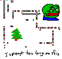

# Day 2 - Piet

If you've never heard of Piet, now's your chance to stop reading and turn back.

Piet is an esoteric language where you draw your code with coloured pixels as opposed to using any text. The original language specification was written by dangermouse, but an official Piet interpreter has never been written. It uses a direction vector to navigate a 2D grid of pixels where the subsequent changes in hues or brightness correspond to a specific command. It is a stack based language, so every command interacts with the stack in some way.

This means that I ditched my keyboard for a mouse and turned on my artistic brain.

And all I did was step into a world of pain.

Simply trying to grasp the fundamentals of Piet and write my first program was a mammoth effort and only possible thanks to existing projects such as Pietron, a graphical IDE that made writing and debugging Piet easier. By the time I had solution to Part One, it was 3am and this was when I realised.

All existing Piet interpreters were either too outdated or too slow to run program. This was because the problem had values in the order of billions and needed to be looped. A trivial task for any self-respecting programming language, but not for Piet.

At 3am, I was burnt out and my Piet solution only solved the test cases for the first part but was too inefficient to solve the whole problem, not to mention I would have to write a new program for part two.

So I solved the rest in Python.

I tried, failed, and I learned an important lesson. Not all programming languages are created equal.

Anyways, here's my creation

